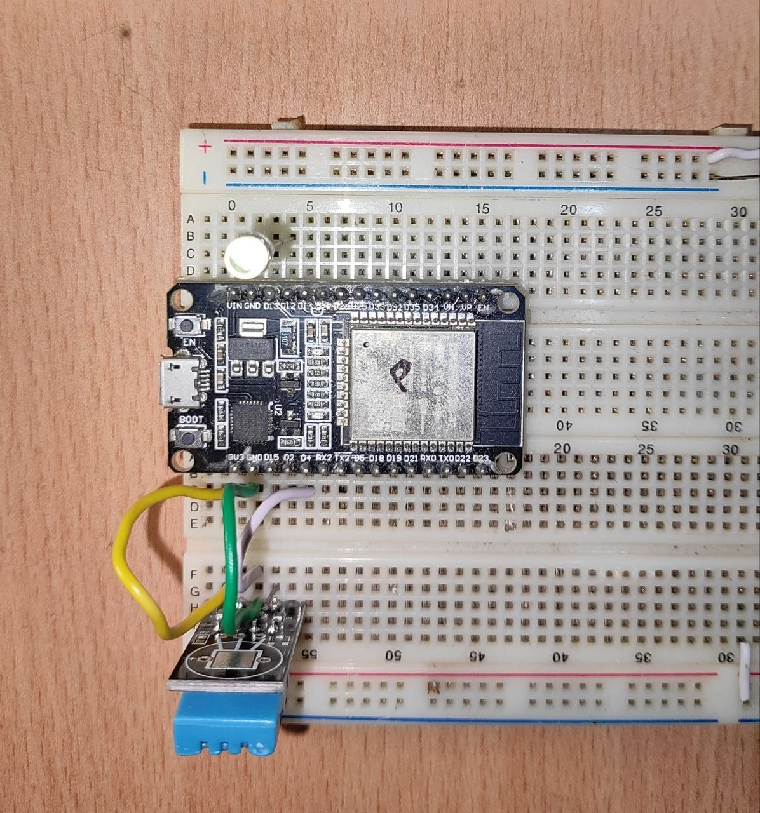
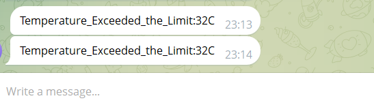
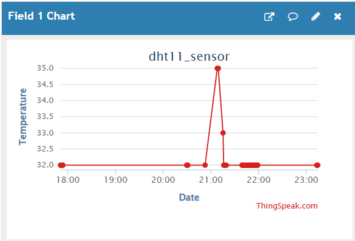
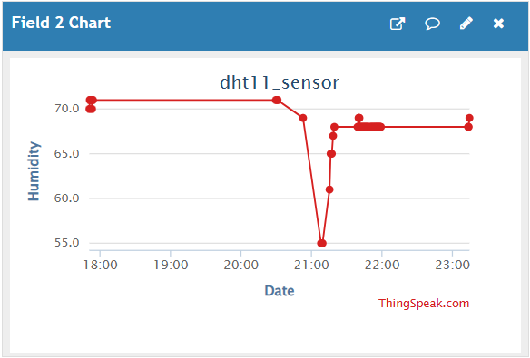
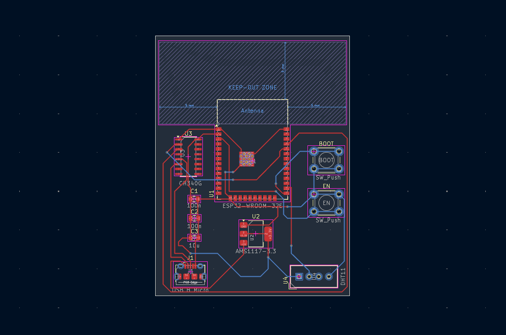
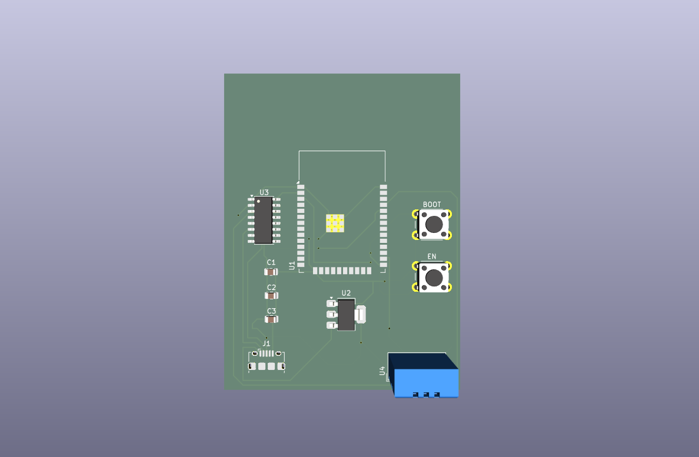
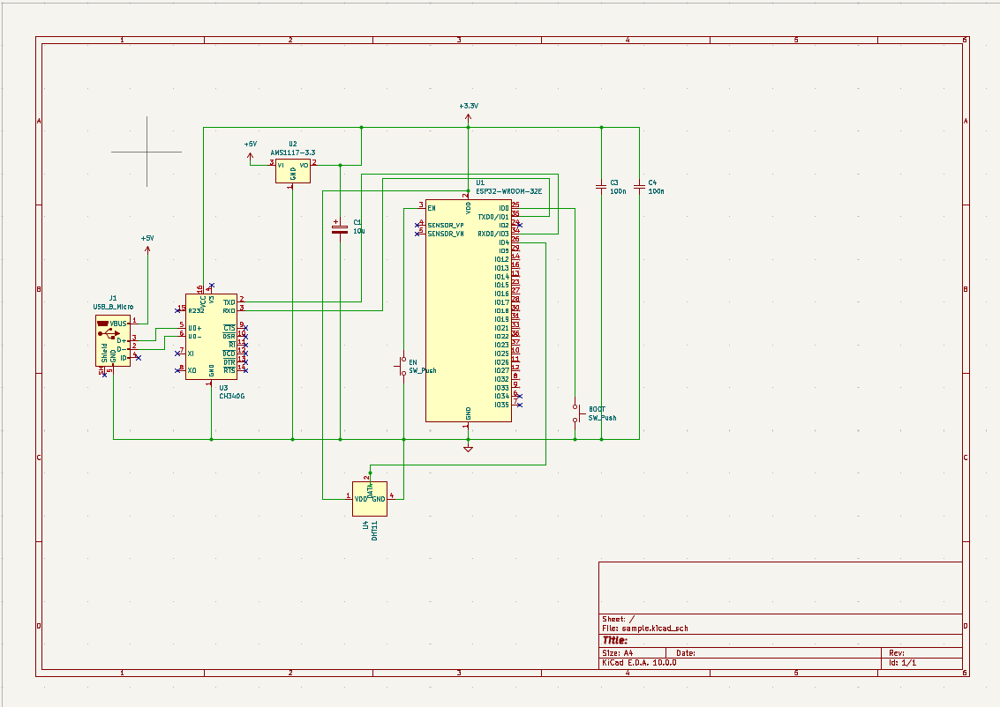

# ESP32 Environmental Monitor

An IoT environmental monitoring system built on ESP32 and MicroPython that reads temperature and humidity using a DHT11 sensor, logs data to ThingSpeak via MQTT for live graphing, and sends threshold-based alerts via a Telegram bot.

---

## Features

- **Real-time sensing** — reads temperature and humidity every 60 seconds via DHT11
- **Cloud logging** — pushes data to ThingSpeak (Field 1: Temp, Field 2: Humidity) over MQTT
- **Live dashboard** — visualise sensor data on ThingSpeak's built-in web graphs
- **Telegram alerts** — sends an instant message when temperature exceeds 35°C
- **LED feedback** — onboard LED (GPIO 12) blinks on every successful ThingSpeak publish
- **WiFi auto-connect** — reconnects automatically on startup

---

## Hardware Required

| Component | Quantity |
|-----------|----------|
| ESP32 DevKit | 1 |
| DHT11 Temperature & Humidity Sensor | 1 |
| Jumper wires | ~4 |
| Breadboard | 1 |

**Wiring:**

| DHT11 Pin | ESP32 Pin |
|-----------|-----------|
| VCC | 3.3V |
| GND | GND |
| DATA | GPIO 4 |

> LED blink feedback uses GPIO 12

## Circuit

<table>
  <tr>
    <td align="center"></td>
  </tr>
</table>

---

## Software & Libraries

- [MicroPython](https://micropython.org/) — firmware for ESP32
- `dht` — built-in MicroPython DHT11 driver
- `network` — built-in WiFi module
- `umqtt.simple` — lightweight MQTT client for MicroPython
- `urequests` — HTTP client (used for Telegram alerts only)
- [Thonny IDE] — for flashing files

---

## Setup & Configuration

### 1. Flash MicroPython on ESP32
Download the latest MicroPython firmware to ESP32 using Thonny IDE.

### 2. Clone this repository

### 3. Configure credentials
Copy `config_example.py` to `config.py` and fill in your details:

```python
SSID     = "your_wifi_name"
PASSWORD = "your_wifi_password"

# ThingSpeak MQTT — from Account → My Profile → MQTT API Key
THINGSPEAK_MQTT_CLIENT_ID = "esp32-room1"        # any unique string
THINGSPEAK_MQTT_USER      = "your_username"
THINGSPEAK_MQTT_PASSWORD  = "your_mqtt_api_key"  # NOT the Write API Key
THINGSPEAK_CHANNEL_ID     = "your_channel_id"    # number in your channel URL

# Telegram
TELEGRAM_TOKEN   = "your_bot_token"
TELEGRAM_CHAT_ID = "your_chat_id"
```


### 4. Upload files to ESP32
Using Thonny: open each `.py` file and use **File → Save as → MicroPython device (as main.py)**.

### 5. Monitor output
Open Thonny's shell or any serial terminal at 115200 baud. You should see:
```
WiFi connected: 192.168.x.x
MQTT connected to mqtt3.thingspeak.com
Published via MQTT — Temp: 28  Humidity: 65
```

### 6. View the dashboard
Go to your ThingSpeak channel → **Private View** or **Public View** to see live graphs for temperature and humidity.

### 7. Monitor the bot after increasing the temperature above threshold
You will get a message saying "Temperature_Exceeded_the_Limit: threshold_value C"

<table>
  <tr>
    <td align="center"></td>
  </tr>
</table>

---

## How It Works

```
DHT11 Sensor
     │
     ▼
ESP32 (MicroPython)
     ├── Every 60s: MQTT publish → mqtt3.thingspeak.com → Live Web Graph
     └── If temp > threshold°C: HTTP GET → Telegram Bot API → Phone Alert
```

1. On boot, ESP32 connects to WiFi then establishes a persistent MQTT connection to `mqtt3.thingspeak.com`
2. Every 60 seconds, `sensor.measure()` reads temperature and humidity
3. Both values are published to ThingSpeak via MQTT (`field1=temp&field2=humidity`)
4. If the MQTT connection drops, the device automatically reconnects before the next publish
5. If temperature exceeds the threshold, a Telegram alert is sent via HTTP GET
6. The onboard LED blinks once to confirm a successful publish

> **Why MQTT over HTTP?** MQTT uses a persistent broker connection — the ESP32 publishes once and all subscribers receive it instantly. This also enables a future receiver node (e.g. an ESP8266 with a buzzer) to subscribe to the same topic and react in real time, which HTTP polling cannot do cleanly.

---

## ThingSpeak Data

<table>
  <tr>
    <td align="center"></td>
    <td align="center"></td>
  </tr>
</table>

---

## Telegram Bot Setup

1. Message @BotFather on Telegram
2. Send `/newbot` and follow the prompts to get your **Bot Token**
3. Start a chat with your new bot, then visit:
   `https://api.telegram.org/bot<TOKEN>/getUpdates`
4. Copy the `chat.id` value from the response — that is your **Chat ID**
5. Paste these into `config.py`

---

## PCB Design

A custom 2-layer ESP32 breakout PCB was designed in KiCad as the hardware foundation 
for this project, replacing the breadboard prototype.

**Key features of the PCB:**
- ESP32-WROOM-32E as the main controller
- CH340G USB-to-UART for direct USB programming
- AMS1117-3.3 voltage regulator (5V USB → 3.3V)
- DHT11 sensor footprint onboard
- EN and BOOT buttons for flashing
- Decoupling capacitors on power rails

### PCB Layout

<table>
  <tr>
    <td align="center"></td>
    <td align="center"></td>
  </tr>
</table>

### Schematic

<table>
  <tr>
    <td align="center"></td>
  </tr>
</table>


## Future Improvements

I was planning to add an ESP8266 receiver node that subscribes to the same MQTT topic and triggers a buzzer alert locally when temperature crosses the threshold — this is exactly the kind of multi-device real-time use case that makes MQTT the right choice over HTTP.

Beyond that, this project was built as a data collection foundation for an Edge TinyML anomaly detector running on the ESP32 itself.

> Instead of hardcoded thresholds (`if temp > 35`), a tiny ML model will learn what *normal* looks like
> and flag anomalies automatically — no cloud inference, no fixed rules.

---

## License

MIT License — see [LICENSE](LICENSE) for details.
